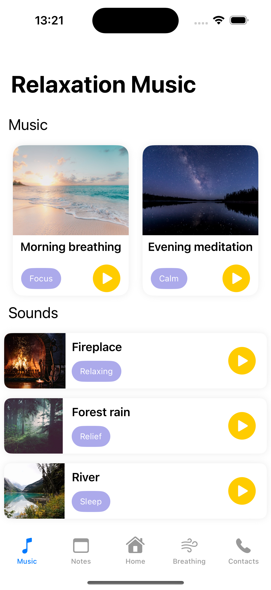
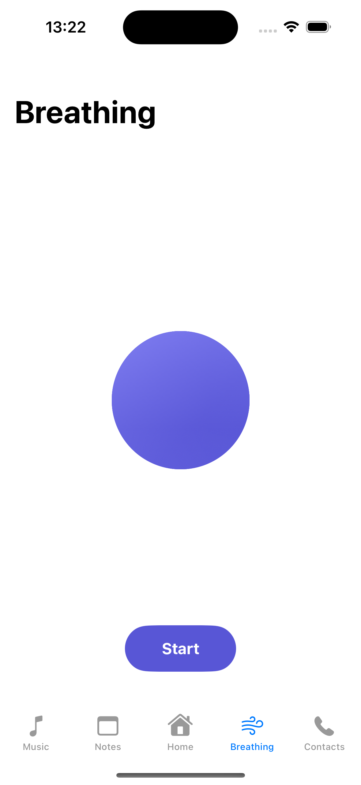
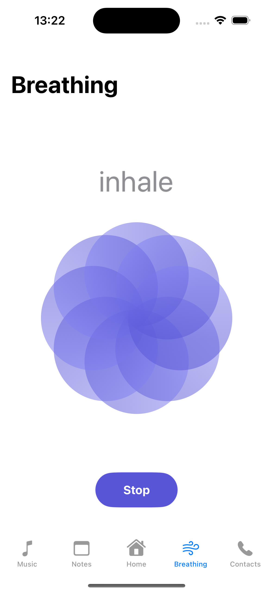
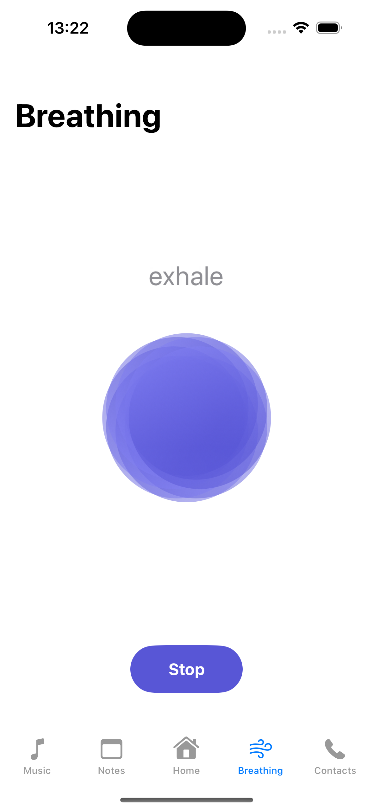
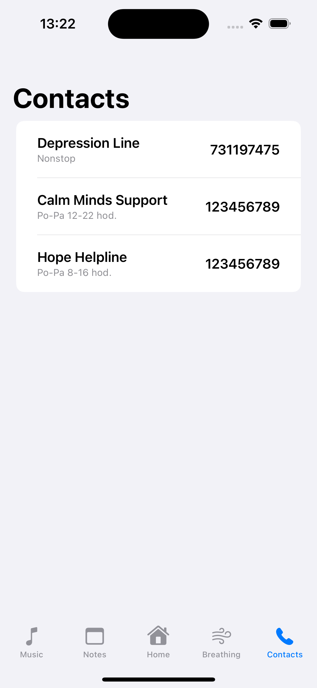
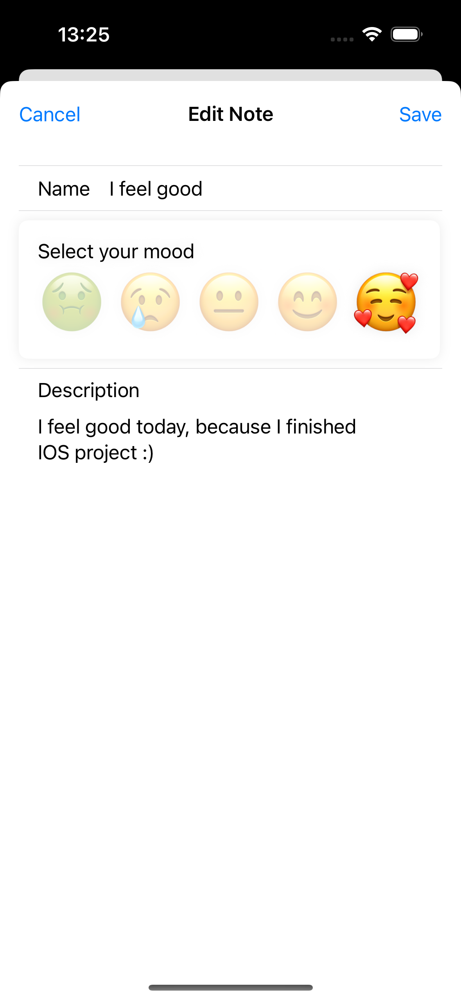
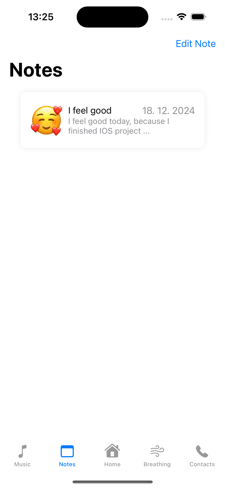
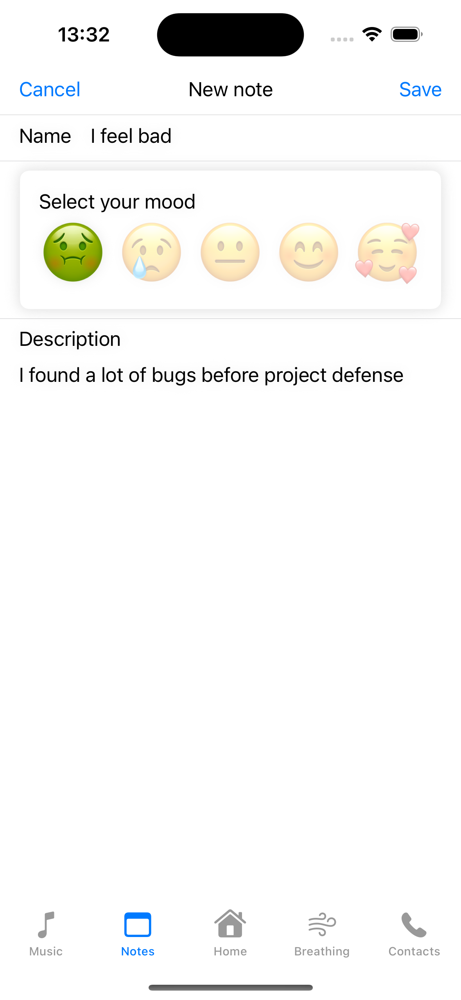
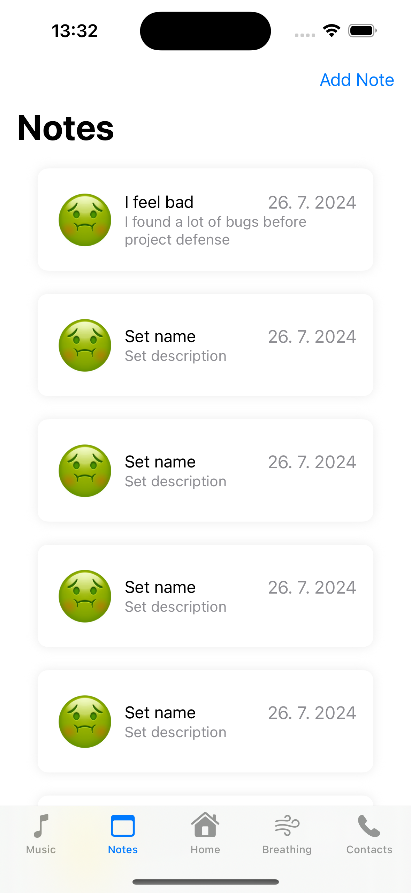
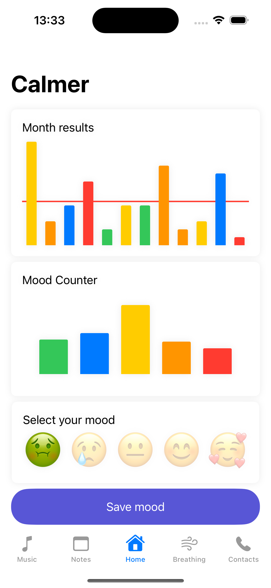

# Calmer

Final project for course *Application Development for iOS 1*, taught at [PEF MENDELU], (https://pef.mendelu.cz/), graded 40/40 points

## Description

A simple app to track your daily emotions with mood notes. Choose from 5 moods, listen to calming music, practice deep breathing with calming animation, view support contacts, and explore statistics like monthly mood trends and mood count.

## Authors

- [David Krčmář](https://www.linkedin.com/in/david-krcmar-943182235/)
- [Jiří Daniel Šuster](https://www.linkedin.com/in/ji%C5%99%C3%AD-daniel-%C5%A1uster-7017b0306/)

## Screenshots

## License

[MIT](https://choosealicense.com/licenses/mit/)

